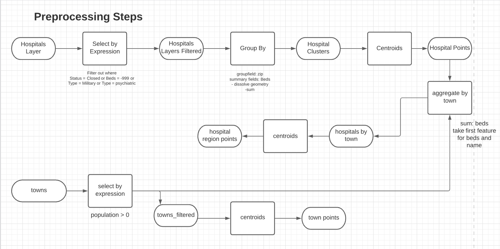
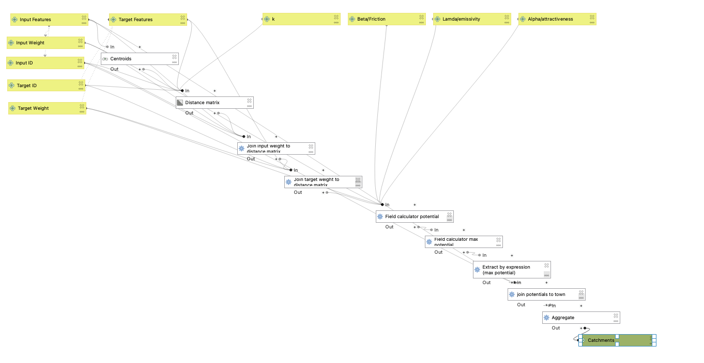
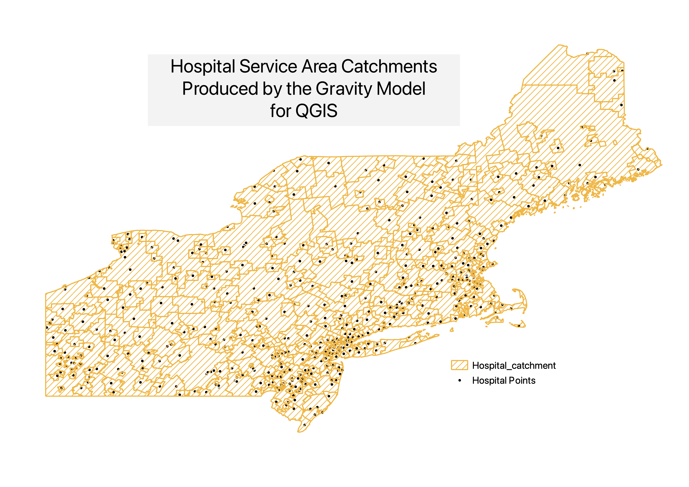

Welcome to my work exploring the development of model building in QGIS,
specifically for the gravity model of spatial interaction.
This model can be applied to determine catchment areas for any type of services,
and in this example the model is run to determine hospital services areas.

## How to Apply the Gravity Model

In a brief summary, the model works by taking an origin destination with a
specified input/origin weight, and a target destination (point layer). The model
uses variable of weight/attractiveness, and distance between the origin and the
target to determine the likelihood that an area will interact with a target.
The model relies on the derived equation:
(inputWeight)^λ * (targetWeight)^α / (distance)^β  which can be found in
[The Geography of Transport Systems,](https://transportgeography.org/contents/methods/spatial-interactions-gravity-model/) along with further information about the
fundamentals of the model.

The applications of the Gravity Model are incredibly useful when considering
problems of inequity and access in regards to the spatial
distribution of COVID-19 testing centers and vaccine allocation centers.
While my application of the model mapped hospital service areas, these service
areas could also be meaningful in considering which communities would likely
have the highest access to these pandemic resources.

## Project Deliverables

Before beginning the model I performed a set of preprocessing steps on the
hospital data, which was downloaded from the [Dartmouth Health Atlas](https://hifld-geoplatform.opendata.arcgis.com/datasets/6ac5e325468c4cb9b905f1728d6fbf0f_0).

While further steps could transform this workflow into a
stand alone function, I chose to instead use a workflow because
of the broad, and often data specific preprocessing steps that
are needed to prepare data for the Gravity Model.

## Model for QGIS
The .model3 file for my model can be found [here](assets/gravityModel.model3)!

## Map Deliverables
The catchments produced by this gravity model can be compared to
health care regions that have been determined by
the Dartmouth Health Atlas. Comparing our generated catchments with these polygons is useful in testing the accuracy of our model and the geoproccessing steps, and to potentially identify areas that need increased attention, or additional advanced parameters that should be considered.

You can check out the interactive web map [here](assets/index.html)

as well as static maps shown below that illustrate the same layers.

## Results
I tested the gravity model produced above by examining the hospital service areas for the Northeastern United States. The results show some geographic with clear similarities between the Dartmouth Health Areas and the model's generated catchments. While the results of this model are not horribly inaccurate, this model could be further developed to better reflect the intended purpose, and to be replicated in a broad scope of other geospatial processes. In addition, I could have changed some of the function's parameters, such as the values used for λ,α, and β, all of which were kept at the default values. Furthermore, this analysis of spatial interaction could be refined and improved to take into consideration road networks, which would generate hospital catchment areas based on the distance from origin to target destination along a road network, not just on euclidian distance alone.
Lastly, it is important to note areas of uncertainty in this analysis that could be improved by the use of additional qualitative research. By speaking with individuals to understand factors that influence where people go for hospital access when given the choice, these results can be compared to other demographic and non-spatial factors that influence the attractiveness of a hospital, (or other service area.)

## Acknowledgements
I would like to thank Joe Holler and the rest of the Open Source GIS Class for the collaboration and communal troubleshooting that made this project possible!
Special thanks to my peer and friend Emma Brown for working through some of the
model issues with me, and for keeping me on track.
