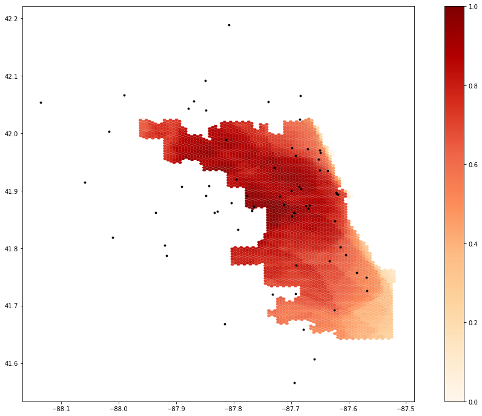

**Replication of**
# Rapidly Measuring Spatial Accessibility of COVID-19 Healthcare Resources: A Case Study of Illinois, USA

Original study *by* Kang, J. Y., A. Michels, F. Lyu, Shaohua Wang, N. Agbodo, V. L. Freeman, and Shaowen Wang. 2020. Rapidly measuring spatial accessibility of COVID-19 healthcare resources: a case study of Illinois, USA. *International Journal of Health Geographics* 19 (1):1–17. DOI:10.1186/s12942-020-00229-x.

Replication Author:
Brooke Laird

Replication Materials Available at: [brookelaird/RP-Kang](https://github.com/brookelaird/RP-Kang)

Created: `19 May 2021`
Revised: `19 May 2021`

## Introduction

The use of geospatial technology is essential for analyzing the accessibility and the distribution of resources during the COVID-19 pandemic. In the initial study by Kang et. al the authors answer three significant questions that illuminate patterns of access and demographic differences for the city of Chicago--to what extent residents have access to healthcare resources, which geographic areas have access to abundant resources and which have insufficient resources, and to what extent is this spatial accessibility associated with socio-economic and demographic characteristics? (Kang et al 2020). By answering these questions, communities can work to understand how individuals are able to interact with health care resources, and where future resources should be allocated.

The paper found that two significant healthcare resources for dealing with the COVID-19 crisis--ICU beds and ventilators--were not evenly accessible throughout the state. Measurements of accessibility were based on the two-step floating catchment area method, which considers accessibility from zip code centroid points to hospital locations through a road network analysis.

The intention for replicating this study by Kang et al (202) is to strengthen the ways that new cyberinfrastructure technology can be used to improve measurement of access. With new platforms for geospatial analysis, any replication or reproduction is useful for improving and expanding the methods, either by modifying the code or making improvements to access of data or information. Additionally, by expanding this type of analysis into new states, or different health care topics, the unequal distribution of resources across spatial scales can be better addressed as a problem of social, environmental, and health justice.

## Materials and Methods

The code and methods for this analysis were conducted in a Jupyter Notebook, hosted by the [cybergisx platform](https://cybergisxhub.cigi.illinois.edu/). The program, which utilizes python as its programming language, uses [Chicago census tract population data](https://www.census.gov/data.html), regional hospital data from the [Illinois Department of Public Health](https://www.dph.illinois.gov/) and a road network from [OpenStreetMap](https://www.openstreetmap.org) to produce final visuals that illustrate the distribution of hospital accessibility. In the original methods found in the [Jupyter Notebook](link), the data is loaded in, and hospitals are georeferenced to their closest node on the network. Then, population centroids were created at the zip code level, and used in the network analysis to reflect distance from one area to the nearby hospitals. The population centroids are also used to create catchment areas around hospitals, which were based on travel time on the road network, not distance. Because the network analysis was based on travel time, some one way roads and roads without labeled speed limits had to be adjusted in the code.
	After creating the two-step floating catchment areas and finding the people within the different catchment areas, the code then created a serve to population ratio. The first ratio was based on available beds (or ventilators) to the at-risk population (defined in the initial code as the population above 50 years old), and the second ratio was beds (or ventilators) per COVID-19 patients. Three distance thresholds/ zones were created using a convex hull method, creating a 0-10 minute travel time zone, 10-20 min, and 20-30 min. Hospital accessibility is weighted by each of these distance zones, and points that fall in multiple catchment areas receive a higher level of overall accessibility. After normalizing the data for a given resource, the notebook produces a visual map of overall accessibility, for the indicated population. The model allows users to choose a processor (number of processors between 1 and 4), region (Chicago or Illinois), population (at risk or COVID-19 patient) and the resource (ICU beds or ventilator).
	One change that we made as a class between our first time running the notebook and a second time is a change in the way that the street network is analyzed. While the original analysis for Chicago uses a road network that is clipped to the city lines, our second run of the code accounted for a larger road network using a 30 kilometer buffer around the city. This was a crucial step in creating a more realistic analysis of access, as it better accounts for how people would interact with hospitals and roads that are nearby, but outside the specific study scale. Special thanks to my classmate, [Maja Cannavo](https://majacannavo.github.io/), who helped establish a functioning code block for creating this buffer!
	Although not carried out in the code, one further change I would make to the analysis in order to strengthen measurements of access would be to broaden the ways that populations at risk could be considered. The initial report and documentation classifies the population at risk as people who are over 50 years old. This was based on the fact that as of Aug 2020 95% of covid deaths were of residents 50 years or older. However, this understanding of vulnerability does not account for other members of the population who might experience increased vulnerability. To consider ways that different racial or socio-ecconomic groups may have disproportionate access to COVID-19 healthcare resources, the final model could also calculate ratios based on the number of people of a certain race, or the number of people living below the poverty line per ICU bed or ventilator. This is a crucial step for understanding how demographic factors influence access in a spatial dimension.

## Results and Discussion

The maps below illustrate the identified spatial distribution of access for the city of Chicago. In figure 1, we can see the results for the initial Jupyter notebook, and figure 2 shows the changes to the analysis when a buffer of 30km around the city is used to expand the road network. Areas of uncertainty include the lack of metadata information on the website, and the lack of information about how the distance weights were decided. Additionally, other elements of qualitative information could be useful in strengthening an overall understanding of regional hospital access. The analysis is based on a road network, and does not account for populations who would need to use forms of public transport to travel, or potentially take longer routes if carpooling or ride sharing is being used. Additionally, this analysis assumes that populations will travel to the hospital closest to them where resources are available, and does not account for factors of personal preference, or other non spatial factors.

**Figure 1**: The results of the initial notebook script without any changes made to the code.

**Figure 2**: The results of the notebook script after accounting for a 30km buffer around the road network for the city of Chicago.

## Conclusions

As a student with a limited background in computer science and no prior experience with python language, I was fortunate to have the Jupyter notebook to outline the steps used for this analysis. The use of cyberGISx in this replication was a great way to get oriented to using coding as a form of GIS, especially due to the scale and speed at which analysis was possible. Even when we made edits to the notebook, the software was able to take in data and make our changes in a timely manner, despite the large size of the road network and population data. The accessibility of this notebook and the data through the github repository is influential in expanding the ways that certain populations have access to research like this, especially in a growing world of open source platforms and data. Again, more thorough metadata sections would be helpful for future replications and reproductions, so that potential areas of uncertainty can be addressed.
