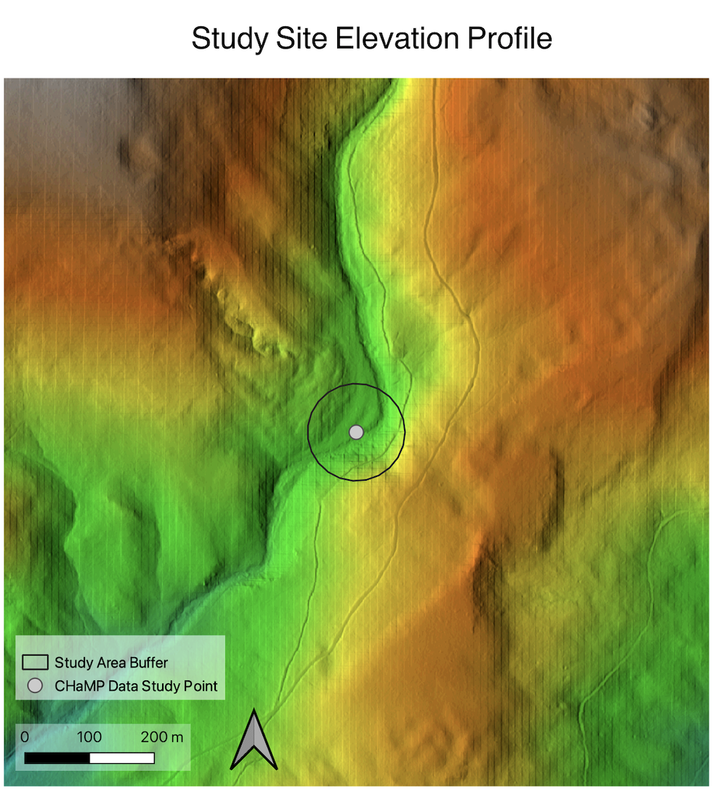
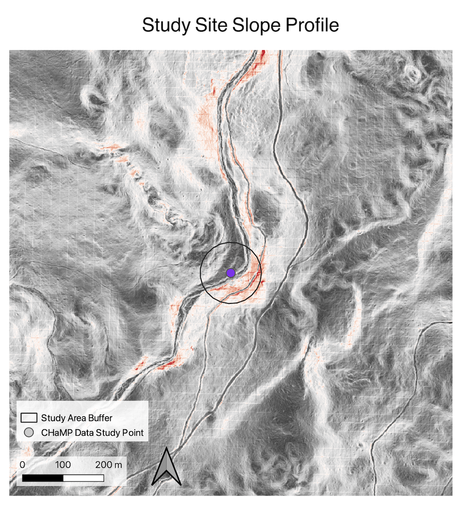
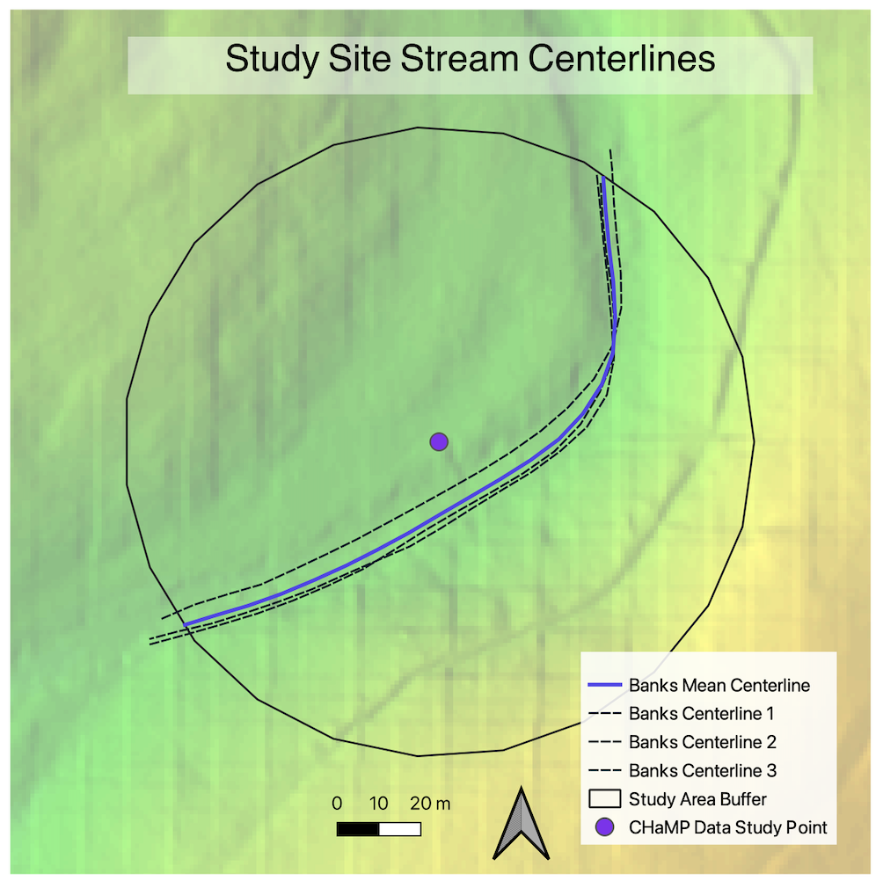
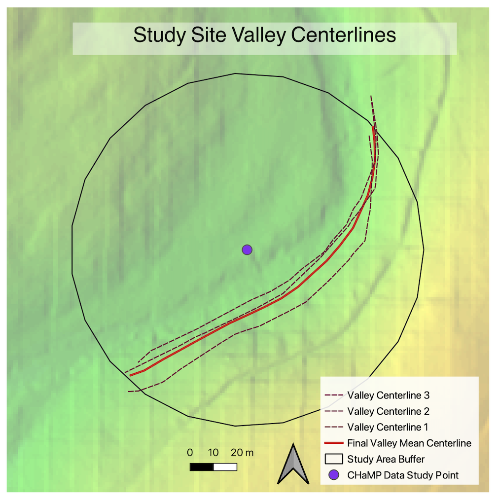
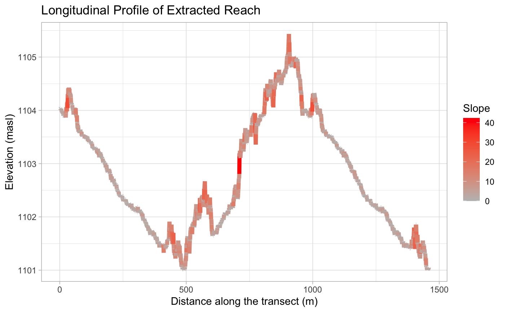
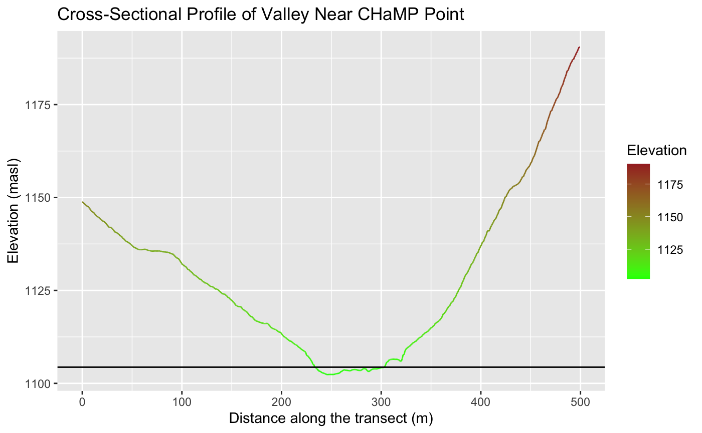
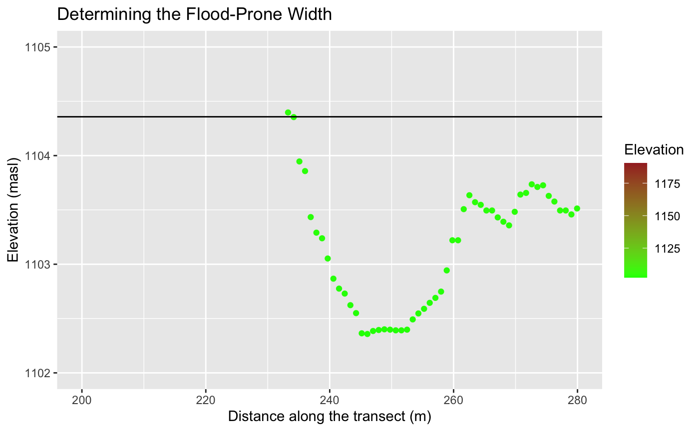

layout: page
title: RE- Replication of Rosgen Stream Classification
---

**Replication of**
# A classification of natural rivers

Original study *by* Rosgen, D. L.
*in* *CATENA* 22 (3):169–199. https://linkinghub.elsevier.com/retrieve/pii/0341816294900019.

and Replication by: Kasprak, A., N. Hough-Snee, T. Beechie, N. Bouwes, G. Brierley, R. Camp, K. Fryirs, H. Imaki, M. Jensen, G. O’Brien, D. Rosgen, and J. Wheaton. 2016. The Blurred Line between Form and Process: A Comparison of Stream Channel Classification Frameworks ed. J. A. Jones. *PLOS ONE* 11 (3):e0150293. https://dx.plos.org/10.1371/journal.pone.0150293.

Replication Authors:
Brooke Laird, Zach Hilgendorf, Joseph Holler, and Peter Kedron.

Replication Materials Available [here](https://github.com/brookelaird/RE-rosgen)

Created: `17 March 2021`
Revised: `23 March 2021`

### Introduction and Motivation:
The classification of river systems is crucial for land planning, watershed management, environmental restoration, and the overall understanding of the dynamic hydrosystems that make up earth's natural environment. While classification systems can run the risk of oversimplifying a complex environment that is home to uniqueness at a variety of scales, the use of GIS tools for implementing a reproducible schema helps with making land planning decisions that can ultimately work to benefit the natural systems, and the livelihoods of the people in nearby communities by predicting the future behavior of the streams. In this analysis we replicated the Rosgen Classification of Natural Rivers, a stream classifications system that is broadly utilized in hydrosystems around the world. Additionally, by reviewing and comparing  Rosgen to a replication study by Kasprak et al. we can gain a stronger understanding of the ways that Rosgen has been deemed successful, how this classification can be critiqued, and how it compares to the three other stream classification methods. Despite strong levels of similarity across the 4 methods, Kasprak et al. emphasize that stream classification can differ due to differences in scale and the weight of certain elements of classification. By replicating the Kasprak study and the methods first developed by Rosgen, we can gain a greater understanding of how stream classification can be performed solely through a GIS approach, and the potential shortcomings of physical geography work that is done without engagement in the field.

##Materials and Procedure:

Within the [Rosgen repository](https://github.com/brookelaird/RE-rosgen) you can find links to code and materials used to conduct the lab.

The procedure for reaching a final stream classification at the location of my Champs Data point can be divided into 3 broad categories: steps in GRASS, steps in R studio, and final calculations based on the Rosgen Classification schema chart.

The procedure in GRASS can be replicated by following the instructions [here](assets/1-Research_Protocol_GRASS.pdf), and 2 GRASS models for [visualizing the data](visualize.gxm) and [calculating the center lines](center_line_length.gxm) allowed many of the intermediate steps to be streamlined into a workflow.

The R. Studio instructions can be found [here](assets/2-ProfileViewer.Rmd), and replicated to create graphs for unique points of interest in the Champs dataset.

Lastly, the outputs from GRASS and R. Studio, along with data from the Champs attribute table in GRASS can be utilized to reach an end classification for levels I and II of the Rosgen Classification, illustrated below. [Source: EPA Website](https://cfpub.epa.gov/watertrain/moduleframe.cfm?parent_object_id=1189)

##Results

Figures to Include:

Table 1. Site Measurements
|Variable | Value | Source|
 |:-: | :-: | :-: |
| Bankfull Width | 7.53 m | BFWdth_AVG from CHaMP Data |
| Bankfull Maximum Depth | .9998m | DpthBf_Max from CHaMP Data |
| Valley Width | 70m | Measured from Terrain Cross-Section Graph (R output) |
| Valley Depth | 1.5m | Estimation from Cross-Sectional Valley Profile (R output) |
| Stream/River Length | 166.897m | GRASS Banks Centerline Length |
| Valley Length | 160.082m | GRASS Valley Centerline Length |
| Median Channel Material Particle Diameter | 32mm | SubD50 from CHaMP Data |

Table 2. Rosgen Level I Classification
|Criteria | Value|
| :-: | :-:|
| Entrenchment Ratio | 9.30 |
| Width / Depth Ratio | 20.20|
| Sinuosity | 1.327 |
| Level I Stream Type | C |

Table 3. Rosgen Level II Classification
|Criteria | Value|
| :-: | :-:|
| Slope | .0032|
| Channel Material | Gravel|
| Level II Stream Type | C4 |

## Unplanned Deviations from the Protocol

Before successfully completing the analysis I needed to instal two additional software programs, [The Unarchiver](https://theunarchiver.com) to unzip my CHaMP datafile, and [XCode](https://developer.apple.com/xcode/) to get add-on plugins into GRASS.

I did not run into many unplanned deviations from the original replication protocol. It is important to note that many of my peers ran into an issue where the study area buffer cut off part of the valley edge, so careful visualization of the study area is necessary before attempting to make sure of the models. One deviation to note is that the slope noted in the table above was calculated by hand using a rise over run formula on the longitudinal profile, instead of using the value that was generated by R. Studio. This is because digitizing errors results in the generation of unrealistic outliers, leading to a very high slope value. After recalculating slope my value changed from 3.91, to .0032, which is more aligned with the values in the Rosgen classification chart.

## Discussion

My analysis at my CHaMP data point (loc_22) classified the river to be a C4, which in the original Rosgen classification paper is listed as a region that has very high sensitivity to disturbance, high likelihood for natural recovery if instability occurs, high sediment supply, and high levels of stream bank erosion. In the Kasprak paper, however, my CHaMP testing location is classified as a A4, deviating from my classification due to differences in the initial entrenchment ratio. The Kasprak paper uses the same field data for the classification, therefore the differences in the classification outcome from the data that we derived from the LiDAR DEM, and slope, and our digitized vector lines on that dataset. Lastly, it is noted that the attribute table for the CHaMP data listed the site as a G4c. Even though the CHaMP data for my site could be potentially outdated (taken in 2012) it is likely that the variations in the Rosgen classification results stem from potential digitizing errors, the lack of ground truthing/field assessment, and a scale that is further zoomed out than in the other two studies.

## Conclusion

This reproduction of both the Rosgen paper and classification, and the Kasprak replication illustrate uncertainty within GIS work and the importance of remaining critical of the tools available at your disposal. Additionally, Kasprak reminds us that while the Rosgen Classification Schema has been widely adopted, there are other methods of river classification that may be better utilized at different locations, or at different scales.

If this was a larger scale project I would have taken further steps to compare the outcome of my Rosgen Classification replication with some of the other methods discussed by Kasprak, such as the River Styles Framework, the Natural Channel Classification and a statistical classification. Additionally, I am curious how other elements of remote sensing beside Digital Elevation Models could be useful to a river classification, such as potentially using public datasets like NAIP or Landsat to conduct a land cover classification or monitoring the changing pathways of a river system over a certain temporal window. Further research on river classification schema, GIS methods for classification, and field analysis are always necessary for helping to refine and improve river classification systems--especially with increased levels of climate disasters in recent decades.

## References

Kasprak, A., N. Hough-Snee, T. Beechie, N. Bouwes, G. Brierley, R. Camp, K. Fryirs, H. Imaki, M. Jensen, G. O’Brien, D. Rosgen, and J. Wheaton. 2016. The blurred line between form and process: A comparison of stream channel classification frameworks ed. J. A. Jones. PLOS ONE 11 (3):e0150293. https://dx.plos.org/10.1371/journal.pone.0150293.
Rosgen, D. L. 1994. A classification of natural rivers. CATENA 22 (3):169–199. https://linkinghub.elsevier.com/retrieve/pii/0341816294900019.

####  Report Template References & License

This template was developed by Peter Kedron and Joseph Holler with funding support from HEGS-2049837. This template is an adaptation of the ReScience Article Template Developed by N.P Rougier, released under a GPL version 3 license and available here: https://github.com/ReScience/template. Copyright © Nicolas Rougier and coauthors. It also draws inspiration from the pre-registration protocol of the Open Science Framework and the replication studies of Camerer et al. (2016, 2018). See https://osf.io/pfdyw/ and https://osf.io/bzm54/

Camerer, C. F., A. Dreber, E. Forsell, T.-H. Ho, J. Huber, M. Johannesson, M. Kirchler, J. Almenberg, A. Altmejd, T. Chan, E. Heikensten, F. Holzmeister, T. Imai, S. Isaksson, G. Nave, T. Pfeiffer, M. Razen, and H. Wu. 2016. Evaluating replicability of laboratory experiments in economics. Science 351 (6280):1433–1436. https://www.sciencemag.org/lookup/doi/10.1126/science.aaf0918.

Camerer, C. F., A. Dreber, F. Holzmeister, T.-H. Ho, J. Huber, M. Johannesson, M. Kirchler, G. Nave, B. A. Nosek, T. Pfeiffer, A. Altmejd, N. Buttrick, T. Chan, Y. Chen, E. Forsell, A. Gampa, E. Heikensten, L. Hummer, T. Imai, S. Isaksson, D. Manfredi, J. Rose, E.-J. Wagenmakers, and H. Wu. 2018. Evaluating the replicability of social science experiments in Nature and Science between 2010 and 2015. Nature Human Behaviour 2 (9):637–644. http://www.nature.com/articles/s41562-018-0399-z.

##Acknowledgements:

A special thank you to Joe Holler for the energy put into this lab, to Arielle and Vincent for figuring out many of our data difficulties, and to Emma Brown and Hannah Rigdon for working
through this with me!  
