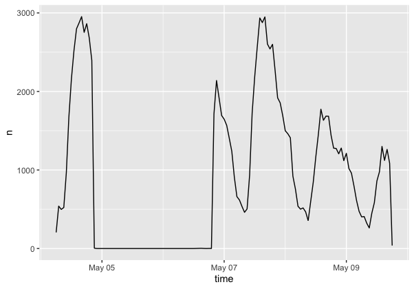
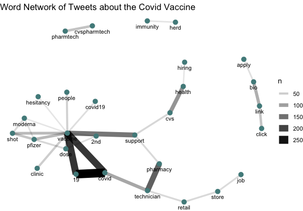
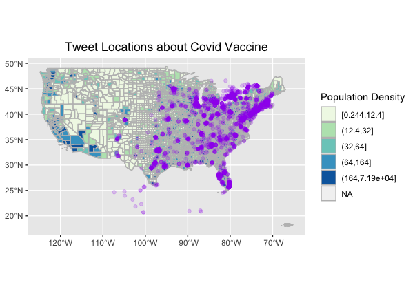
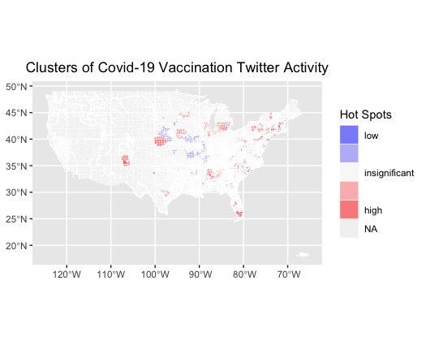

**Replication of**
# Spatial, temporal and content analysis of Twitter data

Original study *by* Wang, Z., X. Ye, and M. H. Tsou. 2016. Spatial, temporal, and content analysis of Twitter for wildfire hazards. *Natural Hazards* 83 (1):523–540. DOI:[10.1007/s11069-016-2329-6](https://doi.org/10.1007/s11069-016-2329-6).
and
First replication study by Holler, J. 2021 (in preparation). Hurricane Dorian vs Sharpie Pen: an empirical test of social amplification of risk on social media.

Replication Author: Brooke Laird

Replication Materials Available at: [brookelaird.github.io](brookelaird.github.io)

Created: `04 May 2021`
Revised: `10 May 2021`

## Abstract

Why study the spatial distribution of Twitter data?

Wang et al (2016) analyzed Twitter data for wildfires in California, finding that the social media data served as a useful tool in characterizing the trends of wildfires across space, and the ways that local community members and groups--specifically local media/news groups and government authorities--can use social media to spread news of disaster updates. While social media has always been a useful piece of data for studying the trends in populations, the increase in geotagged tweets (and other examples of social media data) as a geospatial tool helps with tracking trends that reflect dominant flows of information with a spatial dimension.

Holler (2021) is studying Twitter data for Hurricane Dorian on the Atlantic coast, finding that in spite of tending news and social media content regarding a false narrative of risk, original Tweets still clustered significantly along the real hurricane track, and only along the hurricane track.

Reproducing and replicating spatial research of these two studies, and API research and mapping more generally, continues to be relevant because the increase in studies involving the spatial distribution of twitter data helps to identify areas where API based research can be improved, and also areas where this research has lead to great advancements and new findings.

In this replication study, I will examine the spatial distribution of twitter data that contains the words "vaccine" "pfizer" and "moderna." I centered my analysis on the city of Atlanta, Georgia, and will use twitter data that is available for an 1,000 km buffer around the point, between the temporal window of May 5-May 9, 2021.  My classmates, Emma Brown and Hannah Rigdon, will be completing the same analysis but for different regions of the United States, in hopes of completing a full national map illustrating the spatial distribution of twitter data about Covid-19 vaccinations.

## Original Study Information

The original study by Wang et al (2016) was split into a series of phases to filter and clean the twitter data for analysis and visualization. In the first step (collection), a list of tweets were generated that contained two keywords, "fire" and "wildfire." To refine this search, a second phase was conducted where tweets were paired with a list of places, in order to get data about wildfires that was linked to specific fire incidents. The major difference between these two steps is that while first phase is helpful in getting an understanding of where wildfires are being talked about, the second phase focuses in on the spatial distribution of twitter information surrounding a specific fire event. To analyze the spatial pattern of wildfire tweets, Wang et al (2016) used a kernel density model which developed a raster map of tweet activity, normalized by the population value of the cell. Wang et al (2016) also analyzed twitter data temporally, to see when tweet activity was highest surrounding events of natural disaster. A retweet network map was also generated, helping to visualize what accounts were most dominant in spreading information about the fires.

Holler (2021) losely replicated the methods of Wang et al (2016) for the case of Hurricane Dorian's landfall on the U.S. mainland during the 2019 Atlantic Hurricane season. Data was based on Twitter Search API queries for the key words "dorian," "hurricane," or "sharpigate."

Holler modified Wang et al's methods by not searching for retweets for network analysis, focusing instead on original Tweet content with keywords hurricane, Dorian, or sharpiegate (a trending hashtag referring to the storm). Holler modified the methodology for normalizing tweet data by creating a normalized Tweet difference index and extended the methodology to test for spatial cluserting with the local Getis-Ord statistic. The study tested a hypothesis that false narratives of hurricane risk promulgated at the highest levels of the United States government would significantly distort the geographic distribution of Twitter activity related to the hurricane and its impacts, finding that original Twitter data still clustered only in the affected areas of the Atlantic coast in spite of false narratives about risk of a westward track through Alabama.

Wang et al (2016) conducted their study using the `tm` and `igraph` packages in `R 3.1.2`.
The replication study by Holler (2021) used R, including the rtweet, rehydratoR, igraph, sf, and spdep packages for analysis.

## Materials and Procedure

In my replication of Wang et al (2016) and Holler (2021) I focused on original tweet data, similar to the modification that Holler (2021) chose. Tweets with the words "vaccine" "pfizer" and "moderna" were chosen for analysis. This first round of data downloading produced 118,110 tweets that fit the parameters. These tweet IDs, in the form of a data table, can be found [here](code/vaccineids.txt). Tweets were then filtered to focus on those with a geographic dimension, resulting in the generation of 3,407 tweets to be analyzed spatially.

I also ran a search on all tweets for the 6 day period of the vaccine data, to get a baseline understanding of twitter activity in that location for the time window. The spatial clustering map was normalized by this data, so that areas of high population density were not favored in the analysis. Data was also normalized by population density, with population density per county generated from US Census 2010 estimates.

(add in another section here about next steps in analysis for comparing hot spots to areas of vaccine administration data, or vaccination rates)

## Replication Results

- 
This temporal analysis graph shows when tweets that contained our words of interest (vaccine, pfizer, moderna) were most trending during the 6 day window.

- 
A content analysis graph of the most popular words, and words that were linked together, demonstrate the language that was most frequently used in the tweets. An interesting finding here is the stronger linkage between vaccine and support, over vaccine and hesitancy. However, tweets that contained the word hesitancy do not indicate places where there was hesitancy, instead it shows that vaccine twitter language is more frequently using positive language (support). Furthermore, the links between vaccine and clinic show that twitter is a dominant way that individuals may be able to find out about vaccination opportunities near them.

- 
Tweet locations normalized by population density help to illustrate where tweets were most dominant. Tweet locations still tended to be concentrated in urban areas, which may reflect a common demographic of twitter users (young, urban, educated) (Crawford 2014).

- 
This hot spot analysis map illustrates the clusters of tweets mentioning vaccinations for the buffer around the city of Atlanta, Georgia (not the entire United States). The cluster in southern Florida is interesting, as that is an area that has been a popular travel destination recently.

## Unplanned Deviations from the Protocol

There were few deviations from the replication of the Holler (2021) Hurricane Dorian lab. One change was the addition of a rehydration step to get my data back into R studio, which used the rehydratoR package tool. During the analysis, the only stop words that I used were the common stop words generated by twitter, however in the Dorian lab replication we had used a series of other stop words that made sense for the content.

## Discussion

Provide a summary and interpretation of your key findings in relation to your research question. Mention if findings confirm or contradict patterns observed by Wang et al (2016) or by Holler (2

In summary, the findings of this replication reveal interesting patterns in the types of vaccine related tweets being produced, and the regions where these are most dominant. The high level of tweets that contained words related to employment reveal an interesting trend: that twitter is being used as a way to spread information about vaccine related employment. As the United States continues to find ways to revive the job market, the use of API data and social media will be useful to see if other job markets are using social media as a way to spread information about job opportunity.

Furthermore,  

## Conclusion

This reproduction of both Wang et al. and Holler is a useful tool for starting to use twitter data as a means for examining the spatial distribution of major events--whether they be natural disasters, political moments, or popular trends. As the Covid-19 pandemic shifts in new ways with an increase in vaccination, new variants, and a potential shift to lower regulations, twitter is one place to gather useful data that reflects how different populations share and spread information about these topics.

## References

Include any referenced studies or materials in the [AAG Style of author-date referencing](https://www.tandf.co.uk//journals/authors/style/reference/tf_USChicagoB.pdf).

####  Report Template References & License

This template was developed by Peter Kedron and Joseph Holler with funding support from HEGS-2049837. This template is an adaptation of the ReScience Article Template Developed by N.P Rougier, released under a GPL version 3 license and available here: https://github.com/ReScience/template. Copyright © Nicolas Rougier and coauthors. It also draws inspiration from the pre-registration protocol of the Open Science Framework and the replication studies of Camerer et al. (2016, 2018). See https://osf.io/pfdyw/ and https://osf.io/bzm54/

Camerer, C. F., A. Dreber, E. Forsell, T.-H. Ho, J. Huber, M. Johannesson, M. Kirchler, J. Almenberg, A. Altmejd, T. Chan, E. Heikensten, F. Holzmeister, T. Imai, S. Isaksson, G. Nave, T. Pfeiffer, M. Razen, and H. Wu. 2016. Evaluating replicability of laboratory experiments in economics. Science 351 (6280):1433–1436. https://www.sciencemag.org/lookup/doi/10.1126/science.aaf0918.

Camerer, C. F., A. Dreber, F. Holzmeister, T.-H. Ho, J. Huber, M. Johannesson, M. Kirchler, G. Nave, B. A. Nosek, T. Pfeiffer, A. Altmejd, N. Buttrick, T. Chan, Y. Chen, E. Forsell, A. Gampa, E. Heikensten, L. Hummer, T. Imai, S. Isaksson, D. Manfredi, J. Rose, E.-J. Wagenmakers, and H. Wu. 2018. Evaluating the replicability of social science experiments in Nature and Science between 2010 and 2015. Nature Human Behaviour 2 (9):637–644. http://www.nature.com/articles/s41562-018-0399-z.
